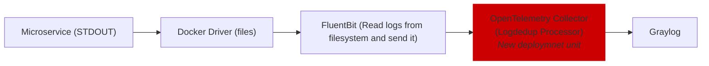

# Log Deduplication Using OpenTelemetry Collector

## Status
**Proposed**
#### Date
2025-04-02
#### Owner
[Denis Filatov](https://github.com/denifilatoff)
#### Participants and approvers
- [IldarMinaev](https://github.com/IldarMinaev)
- [Alexey Karasev](https://github.com/asatt)
- [Vladimir Sitnikov](https://github.com/vlsi)
- [Valentina Feshina](https://github.com/Beauline)
#### Related ADRs
- [0001-opentelemetry-for-traces-metrics-logs](https://github.com/Netcracker/qubership-observability-operator/blob/main/docs/adr/0001-opentelemetry-for-traces-metrics-logs.md)

## Context
Multiple services generate large volumes of duplicate logs due to misconfigured logging levels or redundant log statements. This increases storage costs in the centralized logging system (Graylog). The current stack includes:
- **Logging Agent**: FluentBit (DaemonSet)
- **Log Backend**: Graylog (VM or Kubernetes deployment)

**Key Constraints**:
1. Solutions must work with the existing stack (FluentBit + Graylog).
2. Graylog may be replaced in the mid-term, so the solution should not create long-term vendor lock-in.

## Decision
We will implement log deduplication using the OpenTelemetry Collector with the following logs pipeline:  

Fields `request_id` / `trace_id` have to be excluded from deduplication criteria, for keep transparency in case of search logs by request_id or trace_id. 
### Justification
#### Why OpenTelemetry Collector?
1. **Alignment with Strategy**: Already adopted for traces/metrics ([ADR 0001](https://github.com/Netcracker/qubership-observability-operator/blob/main/docs/adr/0001-opentelemetry-for-traces-metrics-logs.md)).
2. **Backward Compatibility**: Integrates with existing FluentBit configurations.
3. **Flexibility**: Configurable deduplication rules (e.g., time window, log patterns).
4. **Transparency**: Tracks deduplicated message counts in logs.

#### Perfomance validation
Resource consumption for 1000 log records per second for OTEL Collector:
CPU: ~100 millicores
RAM: ~100 Mb

Resource consumption for 1000 log records per second for additional FluentBit:
CPU: ~200 millicores
RAM: ~70 Mb

#### Rejected Alternatives
| Option                         | Pros                                                             | Cons                                                                                                                                                 |
| ------------------------------ | ---------------------------------------------------------------- | ---------------------------------------------------------------------------------------------------------------------------------------------------- |
| Deduplication in **FluentBit** | No additional components No additional network traffic        | `log_suppress_interval` broken (Issue from 2023: [#7051](https://github.com/fluent/fluent-bit/issues/7051))                                          |
| Deduplication in **Vector**    | Single tool for ingestion+dedup No additional network traffic | - Requires re-implementing all parsers, steep learning curve for curent FluetnBit users - There's no output value for deduplicated messages count |

## Consequences
- **Positive**:  
  - Reduces log volume (lower storage costs).  
  - Aligns with OpenTelemetry standards.  
- **Negative**:  
  - Increases network traffic (mitigated by colocating Collector in same AZ as services).  
  - Adds latency (FluentBit ↔ Collector communication).
  - Add additional deployment units
  - Temporary workaround: Requires reconfiguration if Graylog is replaced.  
- **Neutral**:
  - Deduplication logic centralized in Collector, simplifying future migration.  
